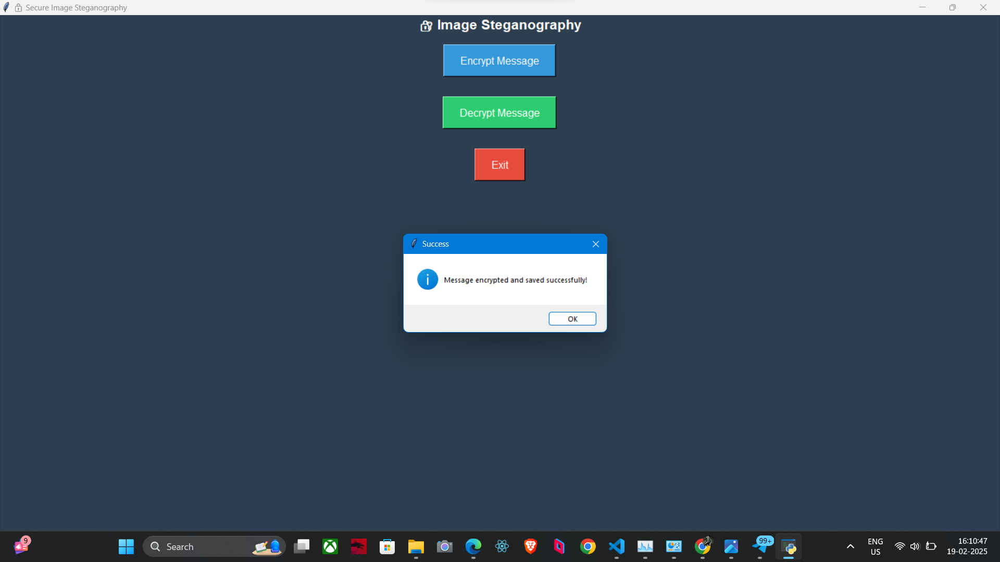
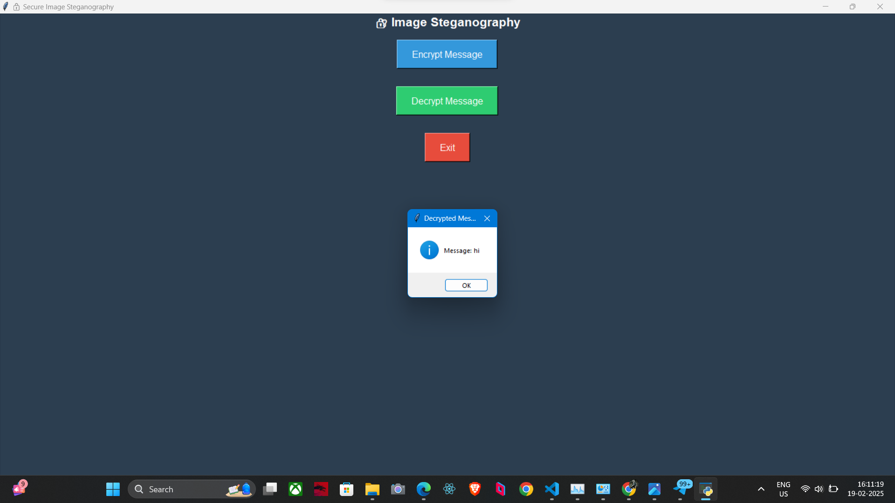

# Secure Image Steganography

## 📌 Project Overview
Secure Image Steganography is a Python-based application that allows users to hide secret messages inside images using a simple graphical user interface (GUI). The project leverages OpenCV, Tkinter, and NumPy to provide an easy-to-use encryption and decryption mechanism, ensuring secure communication.

## ✨ Features
- ✅ **User-Friendly GUI** – Simple interface to encrypt & decrypt messages.
- ✅ **Secure Message Hiding** – Password-protected decryption.
- ✅ **Message Length Encoding** – Prevents garbage output.
- ✅ **Lightweight & Fast** – Minimal dependencies for efficient performance.
- ✅ **Cross-Platform** – Works on both Windows & Linux.

## 🚀 Technologies Used
- **Programming Language:** Python
- **Libraries:** OpenCV, Tkinter, NumPy, Pillow (PIL)
- **Platform:** Windows/Linux

## 🔧 Installation & Usage

### 1️⃣ Install Dependencies
Run the following command to install the required dependencies:
```sh
pip install opencv-python numpy pillow
```

### 2️⃣ Run the Application
Execute the Python script to launch the GUI:
```sh
python steganography.py
```

## 🔐 How It Works
### **Encrypt a Message**
1. Select an image from your system.
2. Enter a secret message and a passcode for encryption.
3. Save the encrypted image with hidden data.

### **Decrypt a Message**
1. Select the encrypted image.
2. Enter the correct passcode.
3. Retrieve and view the hidden message.

## 📸 Screenshots

### Encryption Interface


### Decryption Interface



## 📈 Future Enhancements
- 🔹 **AES Encryption** – Encrypt messages before hiding them for added security.
- 🔹 **Support for Audio & Video Steganography.**
- 🔹 **Enhanced Security Measures** – Improve steganography techniques to reduce detection risks.

## 📂 Repository Structure
```
📂 Secure-Image-Steganography
 ├── steganography.py  # Main Python script
 ├── requirements.txt  # Dependencies
 ├── README.md         # Project documentation
 ├── assets/           # Screenshots & images
 ├── LICENSE           # License file
```

## 📌 Contribution
We welcome contributions! Feel free to fork this repository, submit issues, or suggest enhancements to improve the project.

## 📜 License
This project is open-source and licensed under the MIT License.

---
🚀 Happy Coding & Secure Messaging! 🔒


🔐 How It Works
Encrypt Message:

Select an image.
Enter a secret message & passcode.
Save the encrypted image.
Decrypt Message:

Select the encrypted image.
Enter the correct passcode.
Retrieve the hidden message.
📈 Future Enhancements
🔹 AES Encryption – Encrypt message before hiding it.
🔹 Support for Audio & Video Steganography.
🔹 Make Steganography More Secure – Reduce detection risk.

📂 Repository Structure
bash
Copy
Edit
📂 Secure-Image-Steganography
 ├── steganography.py  # Main Python script
 ├── requirements.txt  # Dependencies
 ├── README.md         # Project documentation
 ├── assets/           # Screenshots & images
 ├── LICENSE           # License file
📌 Contribution
Feel free to fork this repo, submit issues, or suggest enhancements! 🎯

📜 License
This project is open-source under the MIT License.
